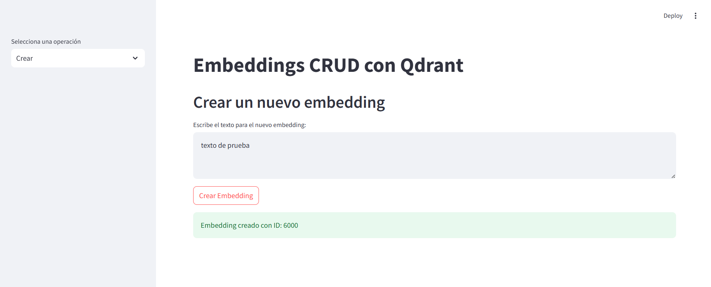
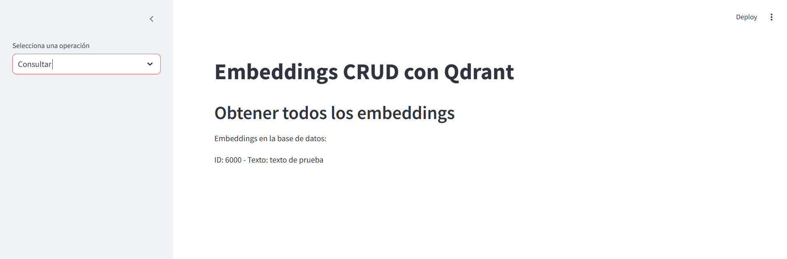
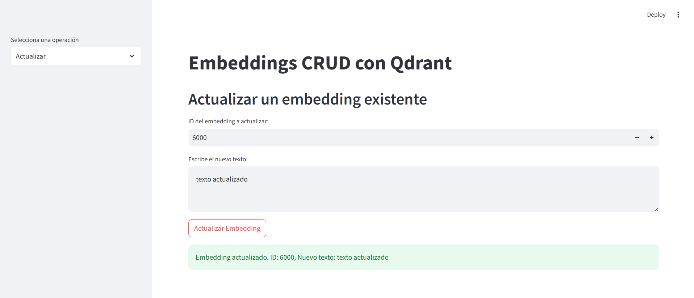
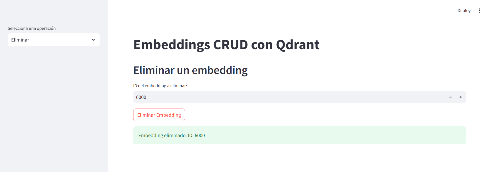

# CRUD con Embeddings 📚

## Introducción 🚀

Este proyecto permite realizar las operaciones de un CRUD (Crear, Leer, Actualizar, Eliminar) sobre embeddings de texto. Utilizando la librería `sentence-transformers` para generar los embeddings. Además, he integrado una base de datos vectorial usando `Qdrant`, facilitando la gestión de los embeddings.

### Características

- **Crear**: Generación de embeddings y almacenamiento en el DataFrame.
- **Leer**: Consulta de embeddings creados
- **Leer similares**: Consulta de embeddings más similares a un vector de consulta usando similitud de coseno.
- **Actualizar**: Modificación de embeddings existentes.
- **Eliminar**: Eliminación de un embedding por su ID.

---

## 📦 Instrucciones de Configuración

Para comenzar a utilizar el proyecto, ejecute los siguientes comandos:

```bash
git clone https://github.com/VeronicaRuizBautista/CRUD_Embeddings.git

cd CRUD_Embeddings

pip install -r requirements.txt
streamlit run app.py

```
### Ingrese a:

**http://localhost:8501**

---

## 🏗️Estructura del Proyecto

**Instalación de dependencias:**
   - `sentence-transformers`: Para generar los embeddings de texto.
   - `Qdrant`: Para almacenar y gestionar los datos de los embeddings.
   - `Streamlit`: Para almacenar mostrar el frontend.

**CRUD de Embeddings:**
   - **Crear**: Inserta embeddings en el DataFrame.
   - **Leer**: Consulta de embeddings creados
   - **Leer similares**: Consulta de embeddings más similares a un vector de consulta usando similitud de coseno.
   - **Actualizar**: Modifica embeddings existentes.
   - **Eliminar**: Elimina un embedding por su ID.

---

## 🧠 Funcionamiento de los Embeddings y Configuración

### ¿Qué son los embeddings? 🤔

Los embeddings son representaciones numéricas de palabras o frases en un espacio vectorial de alta dimensión. Son generados por modelos de lenguaje como `sentence-transformers` para capturar el significado semántico de un texto. Estos vectores permiten comparar y medir la similitud entre diferentes fragmentos de texto.

### Configuración de los Embeddings

1. **Generación de Embeddings**:
   - Uso del modelo `sentence-transformers` para convertir texto en vectores. Estos vectores son los embeddings que se almacenan y procesan.
   
2. **Similitud de Coseno**:
   - Para encontrar embeddings similares a una consulta, se calcula la similitud de coseno entre los vectores. Un valor cercano a 1 indica alta similitud, mientras que un valor cercano a -1 indica baja similitud.

---

## 📝 Ejemplos de Uso

### 1. Crear: Insertar embeddings en Qdrant.

```python
from sentence_transformers import SentenceTransformer
from qdrant_client import QdrantClient
from qdrant_client.models import VectorParams, Distance
import random

# Inicializar el modelo
model = SentenceTransformer('all-MiniLM-L6-v2')

# Inicializar el cliente de Qdrant
client = QdrantClient(
    url="<dominio>", 
    https=True,
    api_key="<api-key>",
)

# Nombre del índice
index_name = "embeddings_index"

# Asegurarse de que el índice existe
client.recreate_collection(
    collection_name=index_name,
    vectors_config=VectorParams(size=384, distance=Distance.COSINE)  # Tamaño del embedding
)

# Datos de ejemplo
texts = ["Este es el primer ejemplo", "Este es el segundo ejemplo", "Y este es el tercero"]

# Generar los embeddings
embeddings = model.encode(texts)

# Generar IDs aleatorios
def generar_id_numerico():
    return random.randint(1000, 9999)

# Insertar los embeddings en Qdrant
for texto, embedding in zip(texts, embeddings):
    nuevo_id = generar_id_numerico()
    client.upsert(
        collection_name=index_name,
        points=[{
            'id': nuevo_id,
            'vector': embedding.tolist(),
            'payload': {'texto': texto}
        }]
    )
```

## 1. Leer: Consultar los embeddings por ID.

```python

# Consultar un embedding específico por su ID
def obtener_embedding_por_id(id_buscar):
    scroll_response = client.scroll(collection_name=index_name, limit=1000)
    
    for batch in scroll_response[0]:
        if batch.id == id_buscar:
            return batch.payload["texto"], batch.vector

    return None  # Si no se encuentra el ID

id_buscar = 2
embedding_buscar = obtener_embedding_por_id(id_buscar)
print("Embedding encontrado:", embedding_buscar)
```
## 2. Leer Similares: Encontrar embeddings más similares usando similitud de coseno.

```python
# Consultar un embedding específico por su ID
def obtener_embedding_por_id(id_buscar):
    scroll_response = client.scroll(collection_name=index_name, limit=1000)
    
    for batch in scroll_response[0]:
        if batch.id == id_buscar:
            return batch.payload["texto"], batch.vector

    return None  # Si no se encuentra el ID

id_buscar = 2
embedding_buscar = obtener_embedding_por_id(id_buscar)
print("Embedding encontrado:", embedding_buscar)

```
### 3. Leer Similares: Encontrar embeddings más similares usando similitud de coseno.

```python
from sklearn.metrics.pairwise import cosine_similarity

# Generar un vector de consulta (por ejemplo, el primer documento)
query_embedding = model.encode(["Este es el primer ejemplo"])[0]

# Buscar los puntos más similares
resultados = client.search(
    collection_name=index_name,
    query_vector=query_embedding.tolist(),
    limit=5
)

# Mostrar los embeddings más similares
print("Embeddings más similares a la consulta:")
for res in resultados:
    print(f"ID: {res.id}, Texto: {res.payload['texto']}, Score: {res.score}")

```

### 4. Actualizar: Modificar un embedding existente.
```python
# Supongamos que queremos actualizar el embedding con ID 2
id_actualizar = 2
nuevo_texto = "Este es el segundo documento modificado"
nuevo_embedding = model.encode([nuevo_texto])[0]

# Actualizar el embedding en Qdrant
client.upsert(
    collection_name=index_name,
    points=[{
        'id': id_actualizar,
        'vector': nuevo_embedding.tolist(),
        'payload': {'texto': nuevo_texto}
    }]
)

print(f"Embedding con ID {id_actualizar} actualizado.")
```

### 5. Eliminar: Eliminar un embedding por su ID.

```python
# Eliminar un embedding por su ID
id_eliminar = 3
client.delete(
    collection_name=index_name,
    points_selector=[id_eliminar]
)

print(f"Embedding con ID {id_eliminar} eliminado.")

```
---
## Imagenes🖼️

# Crear


# Consultar


# Consultar Similares


# Actualiar


# Eliminar

