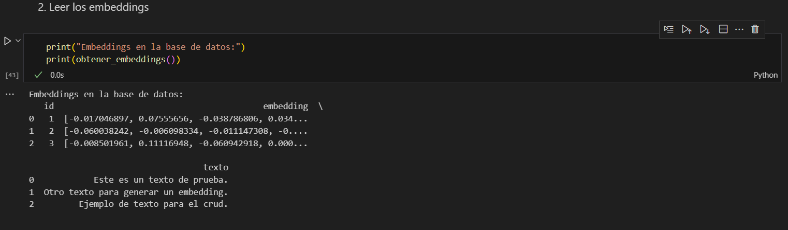
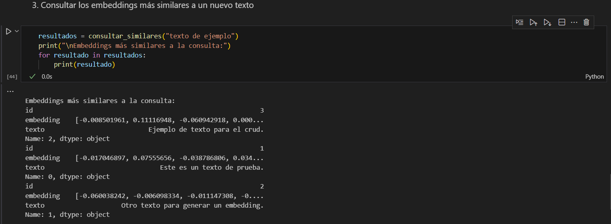
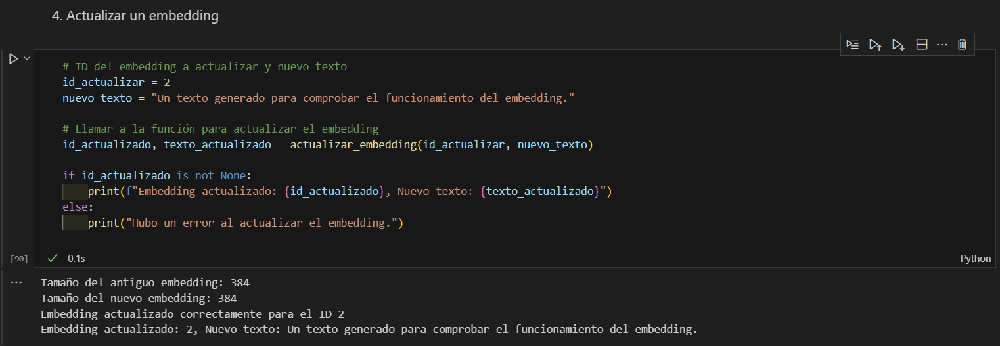
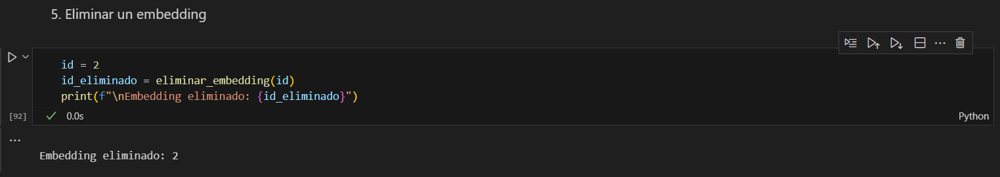
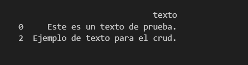

# CRUD con Embeddings 📚

## Introducción 🚀

Este proyecto permite realizar las operaciones de un CRUD (Crear, Leer, Actualizar, Eliminar) sobre embeddings de texto. Utilizando la librería `sentence-transformers` para generar los embeddings y `pandas` y `numpy` para almacenarlos y realizar consultas. Además, he integrado una base de datos vectorial simplificada usando un DataFrame de `pandas`, facilitando la gestión de los embeddings.

### Características

- **Crear**: Generación de embeddings y almacenamiento en el DataFrame.
- **Leer**: Consulta de embeddings creados
- **Leer similares**: Consulta de embeddings más similares a un vector de consulta usando similitud de coseno.
- **Actualizar**: Modificación de embeddings existentes.
- **Eliminar**: Eliminación de un embedding por su ID.

---

## 📦 Instrucciones de Configuración

Para comenzar a utilizar el proyecto, sigue estos pasos:

```bash
git clone https://github.com/VeronicaRuizBautista/CRUD_Embeddings.git

cd CRUD_Embedding

pip install -r requirements.txt
```

---

## 🏗️Estructura del Proyecto

1. **Instalación de dependencias:**
   - `sentence-transformers`: Para generar los embeddings de texto.
   - `numpy`: Para trabajar con arreglos y cálculos.
   - `pandas`: Para almacenar y gestionar los datos de los embeddings.

2. **Configuración de la Base de Datos Vectorial 📊:**
   - Utiliza un **DataFrame de `pandas`** para almacenar los embeddings generados. Esta estructura funciona como una base de datos vectorial simplificada, permitiendo realizar consultas sin necesidad de configurar una base de datos compleja.

3. **CRUD de Embeddings:**
   - **Crear**: Inserta embeddings en el DataFrame.
   - **Leer**: Consulta de embeddings creados
   - **Leer similares**: Consulta de embeddings más similares a un vector de consulta usando similitud de coseno.
   - **Actualizar**: Modifica embeddings existentes.
   - **Eliminar**: Elimina un embedding por su ID.

---

## 🧠 Funcionamiento de los Embeddings y Configuración

### ¿Qué son los embeddings? 🤔

Los embeddings son representaciones numéricas de palabras o frases en un espacio vectorial de alta dimensión. Son generados por modelos de lenguaje como `sentence-transformers` para capturar el significado semántico de un texto. Estos vectores permiten comparar y medir la similitud entre diferentes fragmentos de texto.

### Configuración de los Embeddings

1. **Generación de Embeddings**:
   - Uso del modelo `sentence-transformers` para convertir texto en vectores. Estos vectores son los embeddings que se almacenan y procesan.
   
2. **Similitud de Coseno**:
   - Para encontrar embeddings similares a una consulta, se calcula la similitud de coseno entre los vectores. Un valor cercano a 1 indica alta similitud, mientras que un valor cercano a -1 indica baja similitud.

---

## 📝 Ejemplos de Uso

### 1. Crear: Insertar embeddings en el DataFrame.

```python
from sentence_transformers import SentenceTransformer
import pandas as pd

# Inicializar el modelo
model = SentenceTransformer('all-MiniLM-L6-v2')

# Datos de ejemplo
texts = ["Este es el primer ejemplo", "Este es el segundo ejemplo", "Y este es el tercero"]

# Generar los embeddings
embeddings = model.encode(texts)

# Crear un DataFrame para almacenar los embeddings
df = pd.DataFrame(embeddings)
df['id'] = [1, 2, 3]  # Asignar un ID único a cada embedding
print(df)
```

### 2. Leer: Consultar los embeddings por ID.
```python
# Consultar un embedding específico por su ID
id_buscar = 2
embedding_buscar = df[df['id'] == id_buscar].drop('id', axis=1).values
print("Embedding encontrado:", embedding_buscar)
```


### 3. Leer Similares: Encontrar embeddings más similares usando similitud de coseno.

```python
from sklearn.metrics.pairwise import cosine_similarity
# Generar un vector de consulta (por ejemplo, el primer documento)
query_embedding = df.drop('id', axis=1).iloc[0].values.reshape(1, -1)

# Calcular la similitud de coseno entre el embedding de consulta y todos los demás embeddings
similarities = cosine_similarity(query_embedding, df.drop('id', axis=1))

# Obtener los índices de los embeddings más similares
top_similar_indexes = similarities.argsort()[0][-2:][::-1]  # Excluyendo el primer elemento (el mismo documento)

# Mostrar los embeddings más similares
print("Embeddings más similares a la consulta:")
for idx in top_similar_indexes:
    print(df.iloc[idx])
```

### 4. Actualizar: Modificar un embedding existente.

```python
# Supongamos que queremos actualizar el embedding con ID 2
id_actualizar = 2
nuevo_texto = "Este es el segundo documento modificado"
nuevo_embedding = model.encode([nuevo_texto])

# Actualizar el embedding en el DataFrame
df.loc[df['id'] == id_actualizar, df.columns != 'id'] = nuevo_embedding
print("Embedding actualizado:", df[df['id'] == id_actualizar])
```

### 5. Eliminar: Eliminar un embedding por su ID.

```python
# Eliminar un embedding por su ID
id_eliminar = 3
df = df[df['id'] != id_eliminar]
print(f"Embedding con ID {id_eliminar} eliminado:", df)
```
---
## Imagenes🖼️










